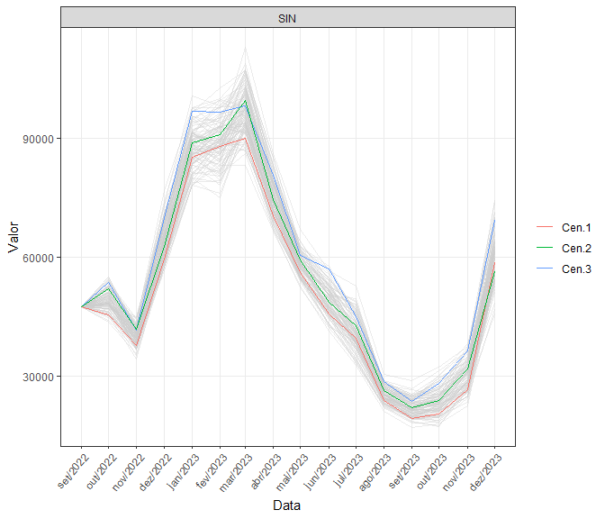

<!-- README.md is generated from README.Rmd. Please edit that file -->

# clustcens

<!-- badges: start -->

[](https://github.com/lkhenayfis/clustcens/actions)
[](https://github.com/lkhenayfis/clustcens/actions)
<!-- badges: end -->

Este pacote prove funcoes para selecao de cenarios de Energia Natural
Afluente, independentemente da metodologia utilizada para gera-los. Alem
dos metodos para selecao de cenarios sao fornecidas ferramentas para
visualizacao da escolha.

## Instalacao

Este pacote ainda nao se encontra disponibilizado no CRAN, de modo que
deve ser instalado diretamente a partir do repositorio utilizando:

``` r
# Caso a biblioteca remotes nao esteja instalada, execute install.packages("remotes") primeiro
remotes::install_github("lkhenayfis/clustcens") # instalacao da versao de desenvolvimento
remotes::install_github("lkhenayfis/clustcens@*release") # instalacao da ultima versao fechada
```

## Exemplo de uso

Abaixo esta um trecho de codigo exemplificando de forma simplificada o
uso das funcionalidades contidas neste pacote. Mais detalhes acerca das
funcoes se encontram em suas respectivas paginas de ajuda.

``` r
library(clustcens)

# selecao de cenarios por PCA + Kmeans (com dado exemplo do pacote)
cenarios <- cenariosdummy["SIN"]
selected <- selecporcluster(cenarios, 3)
plot(cenarios, cenarios[, selected[[1]]])
```


